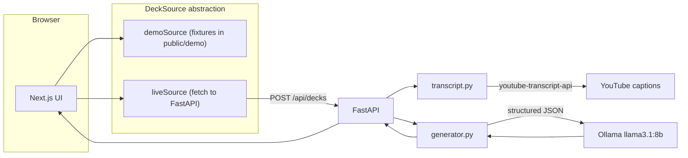

<p align="center">
  
</p>

<h1 align="center">Tubeek</h1>

<p align="center">
  <strong>YouTube → swipeable flashcards</strong> — generated locally with Ollama.<br/>
  No YouTube API key. No cloud LLM.
</p>

<p align="center">
  <a href="https://edvardhov.github.io/tubeek/">Live demo</a>
  ·
  <a href="#quickstart">Quickstart</a>
  ·
  <a href="#run-on-your-machine">Run locally</a>
  ·
  <a href="#license">License</a>
</p>

---

## What it does

Paste a YouTube URL with captions enabled. Tubeek fetches the transcript, asks a local LLM to build Q&A pairs, and opens an interactive deck you can flip and swipe through.

- **Local-first** — transcript scraping + Ollama inference stay on your machine
- **Demo mode** — try sample decks with zero backend (used for [GitHub Pages demo](https://edvardhov.github.io/tubeek/))
- **Live mode** — full pipeline via FastAPI + Ollama

## Architecture



## Tech stack

| Layer | Technology |
|-------|------------|
| Frontend | Next.js (App Router), React, Tailwind CSS v4, Framer Motion |
| Backend | FastAPI, Pydantic, uv |
| AI | [Ollama](https://ollama.com) — default model `llama3.1:8b` |
| Transcripts | [youtube-transcript-api](https://github.com/jdepoix/youtube-transcript-api) (no API key) |

---

## Quickstart

Try the app in under a minute — **no Ollama required**:

```bash
git clone https://github.com/edvardhov/tubeek.git
cd tubeek
cd frontend && npm install && npm run dev
```

Open http://localhost:3000 and click a sample video, or build the static demo:

```bash
# from repo root (requires Node.js + npm)
cd frontend
npm install
NEXT_PUBLIC_APP_MODE=demo npm run build
npx serve out -l 3000
```

---

## Run on your machine

Tubeek was developed on **macOS**, but live mode works on **Linux** and **Windows** too. You need the same pieces everywhere; only install commands differ.

### What you need

| Tool | Version | Used for |
|------|---------|----------|
| [Node.js](https://nodejs.org/) | 22+ | Frontend |
| [uv](https://docs.astral.sh/uv/) | latest | Python deps + backend |
| [Ollama](https://ollama.com/download) | latest | Card generation (live mode only) |
| [Git](https://git-scm.com/) | any | Clone the repo |
| [Docker](https://www.docker.com/) | optional | Containerized frontend + backend |

### 1. Clone and install dependencies

```bash
git clone https://github.com/edvardhov/tubeek.git
cd tubeek
```

**macOS / Linux (with GNU Make):**

```bash
make setup
```

`make setup` installs backend + frontend dependencies. If Ollama is on your PATH it also runs `ollama pull llama3.1:8b`; otherwise it skips that step and prints instructions.

**Windows (PowerShell)** — Make is not included by default. Run the equivalent commands:

```powershell
# Install uv first: https://docs.astral.sh/uv/getting-started/installation/
cd backend
uv sync --extra dev
cd ..\frontend
npm install
```

**Pull the model (all platforms, live mode only):**

```bash
ollama pull llama3.1:8b
```

If Ollama is not installed yet, see platform notes below before pulling.

### 2. Start Ollama

Ollama must be running before generating live decks.

| Platform | Install | Start / verify |
|----------|---------|----------------|
| **macOS** | [Download](https://ollama.com/download) or `brew install ollama` | App runs in menu bar, or `ollama serve` |
| **Linux** | `curl -fsSL https://ollama.com/install.sh \| sh` | `sudo systemctl enable --now ollama` then `ollama pull llama3.1:8b` |
| **Windows** | [Download installer](https://ollama.com/download) | Ollama runs as a background app; verify with `ollama list` in PowerShell |

Check health:

```bash
curl http://localhost:11434/api/tags
```

### 3. Run live mode (two terminals)

**macOS / Linux:**

```bash
# Terminal 1 — API on :8000
make dev-backend

# Terminal 2 — UI on :3000
make dev-frontend
```

**Windows (PowerShell):**

```powershell
# Terminal 1
cd backend
uv run uvicorn app.main:app --reload --host 0.0.0.0 --port 8000

# Terminal 2
cd frontend
npm run dev
```

Open http://localhost:3000, paste a YouTube URL with captions, and generate a deck.

### 4. Docker (optional)

Docker runs the **frontend and backend** containers. Ollama still runs **on the host** so the LLM can use your GPU/CPU directly.

```bash
# Start Ollama on the host first (all platforms)
ollama serve          # macOS/Linux if not already running
ollama pull llama3.1:8b

# Then from repo root
docker compose up --build
```

| Platform | Notes |
|----------|-------|
| **macOS** | Docker Desktop — `host.docker.internal` reaches host Ollama via `extra_hosts` in `docker-compose.yml` |
| **Linux** | Docker Engine — `host.docker.internal:host-gateway` is configured in compose; ensure Ollama listens on `11434` |
| **Windows** | Docker Desktop — same as macOS; install Ollama for Windows separately |

App: http://localhost:3000 · API: http://localhost:8000

---

## Platform tips

### macOS

- Native Ollama uses Apple Silicon GPU when available — recommended for live mode.
- `make setup`, `make dev-backend`, and `make dev-frontend` are the fastest path.

### Linux

- Install build tools if `uv sync` fails on some distros: `sudo apt install build-essential` (Debian/Ubuntu) or equivalent.
- Ollama on Linux uses your CPU/GPU drivers; NVIDIA users should follow [Ollama GPU docs](https://github.com/ollama/ollama/blob/main/docs/gpu.md).
- If `make` is missing: `sudo apt install make` or use the manual commands above.

### Windows

- **Recommended:** [WSL2](https://learn.microsoft.com/en-us/windows/wsl/install) (Ubuntu) + Docker Desktop — then follow the Linux instructions inside WSL.
- **Native Windows:** use PowerShell commands above; install [uv](https://docs.astral.sh/uv/getting-started/installation/) and [Node.js LTS](https://nodejs.org/) for Windows.
- Ollama for Windows runs as a service; keep it running before `npm run dev` / backend startup.
- Path separators: use `cd backend` then `cd ..\frontend` in PowerShell, or run each terminal from the subfolder.

### WSL2 + Ollama

Run Ollama **inside WSL** (not Windows host) if the backend runs in WSL, so `http://localhost:11434` resolves correctly:

```bash
curl -fsSL https://ollama.com/install.sh | sh
ollama pull llama3.1:8b
```

---

## Environment variables

### Backend (`backend/.env` — optional)

| Variable | Default | Description |
|----------|---------|-------------|
| `OLLAMA_HOST` | `http://localhost:11434` | Ollama API endpoint |
| `OLLAMA_MODEL` | `llama3.1:8b` | Model for card generation |
| `CORS_ORIGINS` | `http://localhost:3000` | Allowed frontend origins (comma-separated) |
| `WEBSHARE_PROXY_USERNAME` | — | Optional proxy for transcript fetching |
| `WEBSHARE_PROXY_PASSWORD` | — | Optional proxy password |

### Frontend

| Variable | Default | Description |
|----------|---------|-------------|
| `NEXT_PUBLIC_APP_MODE` | `live` | `live` or `demo` |
| `NEXT_PUBLIC_API_URL` | `http://localhost:8000` | Backend URL (live mode) |
| `NEXT_PUBLIC_BASE_PATH` | — | Set to `/tubeek` for GitHub Pages builds |

---

## Demo mode & GitHub Pages

Static export with pre-baked decks in `frontend/public/demo/`:

```bash
make demo-build-pages   # basePath=/tubeek for GitHub Pages
make demo-serve         # local preview at http://localhost:3000
```

Public demo: **https://edvardhov.github.io/tubeek/**

---

## API

### `GET /api/health`

Returns Ollama and model availability.

### `POST /api/decks`

```json
{
  "url": "https://www.youtube.com/watch?v=...",
  "card_count": 10,
  "language": "en"
}
```

Response:

```json
{
  "video": { "video_id": "...", "url": "..." },
  "deck": {
    "title": "...",
    "cards": [{ "question": "...", "answer": "..." }]
  }
}
```

---

## Development

```bash
make test      # backend pytest
make lint      # backend ruff
cd frontend && npm run lint
```

See [CONTRIBUTING.md](CONTRIBUTING.md) for PR guidelines and regenerating demo fixtures.

---

## Troubleshooting

| Issue | Fix |
|-------|-----|
| Ollama unreachable | Start Ollama; verify `curl http://localhost:11434/api/tags` |
| Model missing | `ollama pull llama3.1:8b` |
| `make: command not found` (Windows) | Use PowerShell commands in this README |
| Backend can't reach Ollama in Docker | Ensure Ollama runs on host; on Linux check `host.docker.internal` / firewall |
| No transcript | Use a video with captions enabled |
| Transcript blocked (datacenter IP) | Run locally; optionally set Webshare proxy env vars |
| CORS errors | Add your frontend URL to `CORS_ORIGINS` |
| Demo works, live doesn't | Live mode needs Ollama + backend on `:8000` and `NEXT_PUBLIC_APP_MODE=live` |

---

## License

MIT — see [LICENSE](LICENSE).
