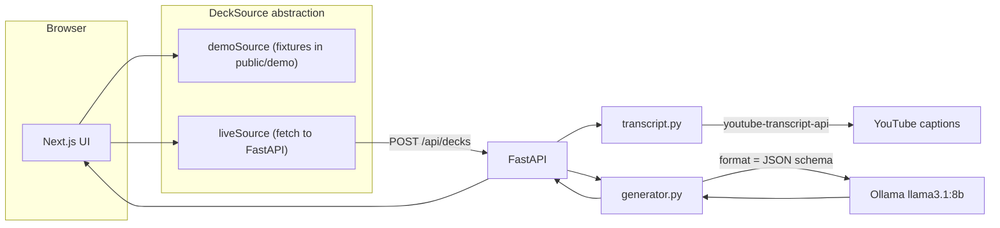

# Tubeek

Local-first app that turns YouTube videos into interactive, swipeable flashcard decks — powered by Ollama and no YouTube API key.

## Demo

Static demo (pre-baked decks, no backend): deploy via GitHub Pages at `/tubeek`.

## Architecture



## Tech Stack

| Layer | Technology |
|-------|-----------|
| Frontend | Next.js (App Router), React, Tailwind CSS, Framer Motion |
| Backend | FastAPI, Pydantic |
| AI | Ollama (llama3.1:8b) with structured JSON outputs |
| Transcripts | youtube-transcript-api (no API key) |

## Quickstart

### Prerequisites

- [Ollama](https://ollama.com/download) (runs natively on macOS for GPU)
- Node.js 22+
- [uv](https://docs.astral.sh/uv/) (Python package manager)
- Docker (optional)

### Setup

```bash
git clone https://github.com/edvardhov/tubeek.git
cd tubeek
make setup
```

This pulls `llama3.1:8b` and installs dependencies.

### Run (native)

Terminal 1 — backend:

```bash
make dev-backend
```

Terminal 2 — frontend:

```bash
make dev-frontend
```

Open http://localhost:3000, paste a YouTube URL, generate a deck.

### Run (Docker)

Ollama must still run **natively on the host** (Docker on macOS cannot use Metal GPU):

```bash
ollama serve   # if not already running
make docker-up
```

## Environment Variables

### Backend (`backend/.env`)

| Variable | Default | Description |
|----------|---------|-------------|
| `OLLAMA_HOST` | `http://localhost:11434` | Ollama API endpoint |
| `OLLAMA_MODEL` | `llama3.1:8b` | Model for card generation |
| `CORS_ORIGINS` | `http://localhost:3000` | Allowed frontend origins |
| `WEBSHARE_PROXY_USERNAME` | — | Optional proxy for transcript fetching |
| `WEBSHARE_PROXY_PASSWORD` | — | Optional proxy password |

### Frontend

| Variable | Default | Description |
|----------|---------|-------------|
| `NEXT_PUBLIC_APP_MODE` | `live` | `live` or `demo` |
| `NEXT_PUBLIC_API_URL` | `http://localhost:8000` | Backend URL (live mode) |

## Demo Mode

Build a static export for GitHub Pages:

```bash
make demo-build-pages   # basePath=/tubeek for GitHub Pages
```

Preview locally (no basePath — assets served from `/`):

```bash
make demo-serve         # builds + serves at http://localhost:3000
```

Demo mode uses pre-baked fixture decks in `frontend/public/demo/`. Sample video chips on the landing page map to these fixtures.

## API

### `GET /api/health`

Returns Ollama and model availability status.

### `POST /api/decks`

```json
{
  "url": "https://www.youtube.com/watch?v=...",
  "card_count": 10,
  "language": "en"
}
```

Response:

```json
{
  "video": { "video_id": "...", "url": "..." },
  "deck": {
    "title": "...",
    "cards": [{ "question": "...", "answer": "..." }]
  }
}
```

## Troubleshooting

| Issue | Fix |
|-------|-----|
| Ollama unreachable | Start Ollama: `ollama serve` |
| Model missing | `ollama pull llama3.1:8b` |
| No transcript | Use a video with captions enabled |
| Transcript blocked (cloud IP) | Run locally; optionally configure Webshare proxy |
| CORS errors | Set `CORS_ORIGINS` to your frontend URL |

## License

MIT — see [LICENSE](LICENSE).
